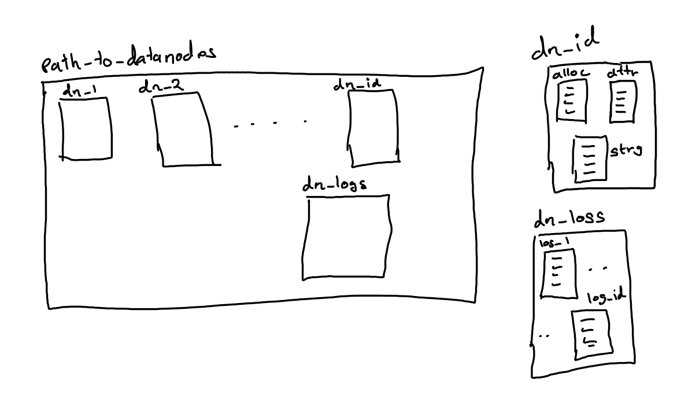

# Data Node Implementation
 
## Major theme:
Every node's disk storage is repersented as a directory

## Storage structure:

As seen from the storage structure
    -> Every datanode directory is stored inside path_to_datanodes directory.
    -> Every datanode stores it's logs in dn_log directory. Datanode logs file contains all operations performd on the datanode since it's creation
    -> Every datanode directory has 3 files namely: alloc.txt, attr.pkl, strg.txt

### Datanode directory contents:
Every valid datanode directory has:
    -> alloc.txt
    -> attr.pkl
    -> strg.txt

strg.txt holds a string of charecters of length = datanode_size * block_size
attr.pkl holds the object of class DN_attr which has the attributes for proper functioning of datanode:
    -> id : datanode id num
    -> dn_dir : datanode_directory
    -> block_size
    -> datanode_size
    -> datanode_log_path : path to the log directory

alloc.txt holds the allocation details of each block in strg.txt. It has datanode_size entries

## Datanode class:
### Constructor

This class supports creation of a new datanode and loading of an existing datanode.
The argument expected is a valid instance of DN_attr

### read_blk
For a valid request, the contents of blk_num in strg is returned

### alloc_blk
The contents to be written into the datanode is expected to be of size = block_size
If the datanode is not full, then the contents are written into the datanode and the blk_num (where the contents) is returned

### free_blks
All blocks associated with the file passed as an argument is freed
    